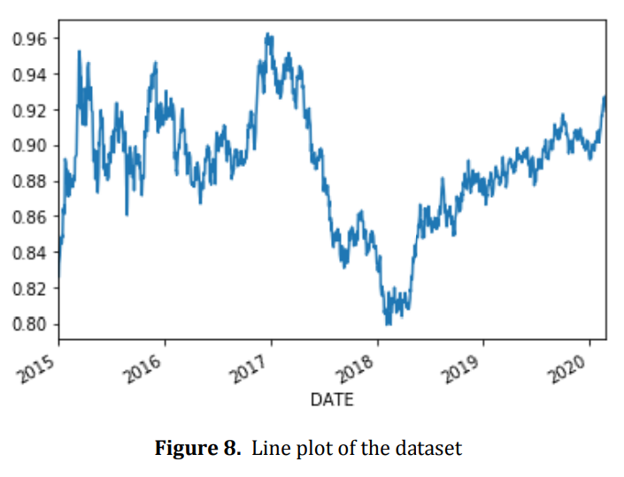
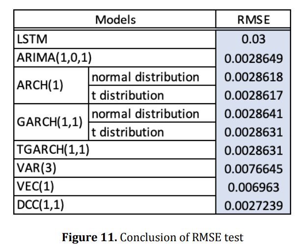

# Forecasting USD/EUR Exchange Rate using Arima, GARCH, VAR and LSTM

## Introduction
This repository contains the implementation of various time series forecasting models to predict the USD/EUR exchange rate. The project explores the use of popular techniques such as ARIMA, GARCH, VAR, and LSTM to model and forecast the currency exchange rate. This project was completed in December 2019 as the final project for the Financial Time Series course at Rutgers University.

## Project Overview
The goal of this project is to develop accurate and reliable models that can forecast the future USD/EUR exchange rate based on historical data. By employing multiple modeling techniques, we aim to compare their performances and identify the most suitable method for predicting the currency exchange rate in different scenarios.

## Data Source
We obtain the data of the exchange rate of USD/EUR from the site of The European Central Bank. We obtain the data of indicators from fred.stlouisfed.org. The time frame of our dataset is 1 month starting from Jan. 2015 to Feb. 2020.

## Methods Used
The following forecasting methods are implemented in this project:

- ARIMA (AutoRegressive Integrated Moving Average): ARIMA is a classical time series forecasting model that combines autoregression and moving average components. It is widely used for modeling univariate time series data.

- GARCH (Generalized Autoregressive Conditional Heteroskedasticity): GARCH is a statistical model used to analyze and forecast time series data with time-varying volatility. It is particularly useful for capturing the volatility clustering often observed in financial data.

- VAR (Vector Autoregression): VAR is a multivariate time series model that can capture dependencies between multiple variables. In this case, we may use it to explore the relationships between the USD/EUR exchange rate and other relevant economic factors.

- LSTM (Long Short-Term Memory): LSTM is a type of recurrent neural network (RNN) that is well-suited for sequence prediction tasks. It is capable of capturing long-term dependencies in time series data.

All models were implemented by Python and R.

## Files
- data
   - "rate.csv" is the data of LSTM model in "LSTM.py". 
   - "rate.csv" is the data of ARIMA, GARCH model.
   - "data.csv" is the data of VAR models.
   - "US_part.xlsx" and "DAILY_part.xlsx" is the data of DCC.
   

- models
   - "LSTM.py" is raw code for LSTM model.
   - "LSTM.html" is the result of "LSTM.py".
   - "models.rmd" is raw code for ARIMA, GARCH,VEC,DCC.

- "FinalReport.pdf", "FTS-TermProject.pptx" have more details about method and implementation.
   
   

## Results

The prediction from DCC-GARCH model is the best compared with others based on their RMSE, and the
limitation of the single model prediction is well avoided.

